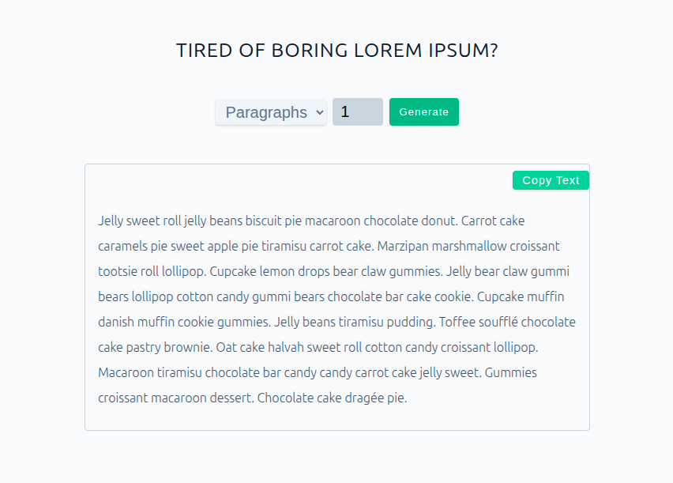
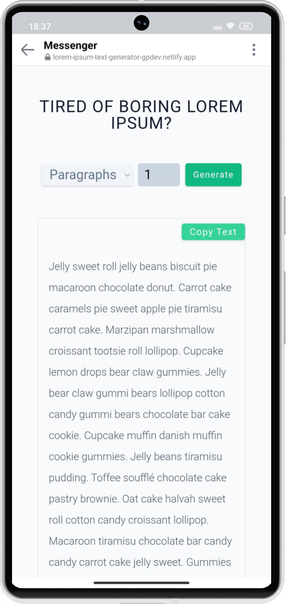

# React Lorem Ipsum Text Generator ⚡


A responsive React application for generating customizable Lorem Ipsum placeholder text. Perfect for developers and designers who need quick dummy text for prototyping and testing applications. Built to practice React state management, component architecture, and modern CSS techniques.

## 🚀 Live Demo

**View Live on Netlify:**  
[Lorem Ipsum Text Generator Demo](https://lorem-ipsum-text-generator-gpdev.netlify.app/)

## 🎯 Problem This App Solves:

- Provides instant access to customizable placeholder text for development
- Eliminates the need to search for external Lorem Ipsum generators
- Offers multiple text formats for different testing scenarios
- Includes one-click copy functionality for seamless workflow integration
- Saves valuable time during development and design prototyping phases

## 👥 Perfect For:

- Frontend developers needing placeholder content
- UI/UX designers creating mockups and prototypes
- Quality assurance testers generating test data
- Anyone requiring quick text content for application testing

## ✨ Features

- **Multiple Text Formats** - Generate paragraphs, sentences, or individual words
- **Customizable Quantity** - Dynamic input limits (1-9 paragraphs, 1-30 sentences/words)
- **Copy to Clipboard** - One-click copying with visual feedback animations
- **Responsive Design** - Optimized for all screen sizes and devices
- **Loading States** - Visual feedback during text generation
- **Clean UI** - Modern, accessible interface with smooth transitions
- **Type-Specific Formatting** - Proper punctuation and formatting for each text type

## 📸 Project Preview

<table>
  <tr>
    <td align="center"><strong>💻 Desktop View</strong></td>
  </tr>
  <tr>
    <td align="center"></td>
  </tr>
  <tr>
    <td align="center"><em>Desktop interface with form controls and generated text</em></td>
  </tr>
  
  <tr>
    <td align="center"><strong>📱 Mobile View</strong></td>
  </tr>
  <tr>
    <td align="center"></td>
  </tr>
  <tr>
    <td align="center"><em>Mobile responsive view with optimized form controls</em></td>
  </tr>
</table>

## 🛠️ Built With

| Tool / Library         | Purpose                      |
| ---------------------- | ---------------------------- |
| ⚡ **Vite**            | Fast build tool & dev server |
| ⚛️ **React 19**        | Component-based UI           |
| 🔑 **Nanoid**          | Unique ID generation         |
| 🎨 **CSS3**            | Flexbox, Grid, animations    |
| 📋 **Clipboard API**   | Copy functionality           |
| 📜 **JavaScript ES6+** | Modern language features     |

## 💡 Implemented Concepts

### State Management

- **useState Hook** - Managing count, text type, loading states, and UI states
- **useEffect Hook** - Side effects for cleaning text when changing types
- **Custom Hooks Pattern** - Organized state logic for maintainability

### Component Architecture

- **Modular Components** - Separated Form and CopyButton components
- **Component Communication** - Effective parent-child communication through props
- **Conditional Rendering** - Dynamic UI based on application state
- **Reusable Utilities** - Separate text generation logic in utils folder

### User Experience

- **Form Validation** - Input constraints and error prevention
- **Visual Feedback** - Animations and state indicators
- **Accessibility** - ARIA labels, keyboard navigation, and semantic HTML
- **Performance** - Optimized rendering with proper keys and efficient updates

## 🎨 Design & Project Extensions

**Original Design Scope:**  
Basic paragraph generator based on course Figma design specifications.
Figma design provided by the course instructor.
[View Original Figma Design](https://www.figma.com/file/JRDDc3aN6uiBS3yvjbkk0s/Lorem-ipsum?node-id=0%3A1&t=cLtQmBowNmb4V0jP-1)

**My Extensions & Enhancements:**

- **Multi-format Generation** - Added sentences and word generation options
- **Enhanced Functionality** - Implemented copy-to-clipboard feature with visual feedback
- **Advanced State Management** - Complex state logic handling multiple text types and UI states
- **Additional UI Components** - Custom form controls and interactive elements
- **Animation System** - CSS animations and transitions for improved user experience
- **Responsive Improvements** - Enhanced mobile experience beyond original design

## 📦 Project Structure

```text
src/
├── components/
│   ├── Form.jsx
│   └── CopyTextButton.jsx
├── utils/
│   └── textGenerators.js
├── data.js
├── App.jsx
└── index.css
```

## 🚀 Getting Started

### Prerequisites

- **Node.js** ≥ 18.0.0
- **npm** or **yarn** package manager

### Installation

1. Clone the repository

```bash
git clone https://github.com/pro804/Lorem-Ipsum-Text-Generator.git
```

2. Navigate to the project directory

```bash
cd Lorem-Ipsum-Text-Generator
```

3. Install dependencies

```bash
npm install
```

4. Start the development server

```bash
npm run dev
```

5. Open http://localhost:5173 to view it in the browser.

## 🔧 Available Scripts

- `npm run dev` — Runs the development server (Vite)
- `npm run build` — Builds the app for production
- `npm run preview` — Previews the production build locally

## 📄 License

This project was created for educational purposes as part of a React learning journey. The original design was provided by course materials, with extensions and enhancements implemented independently.
